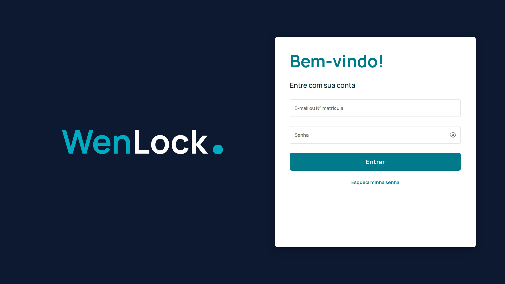
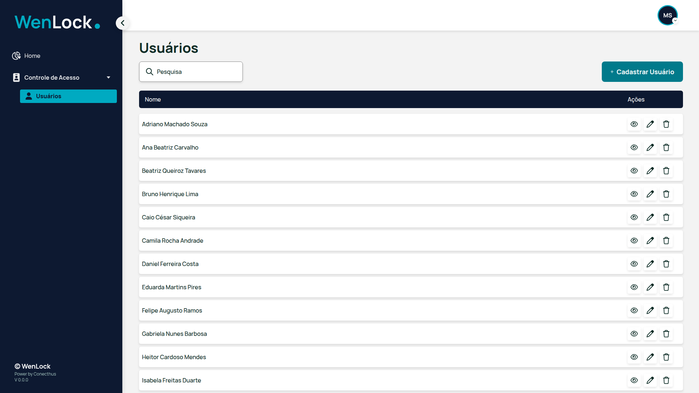
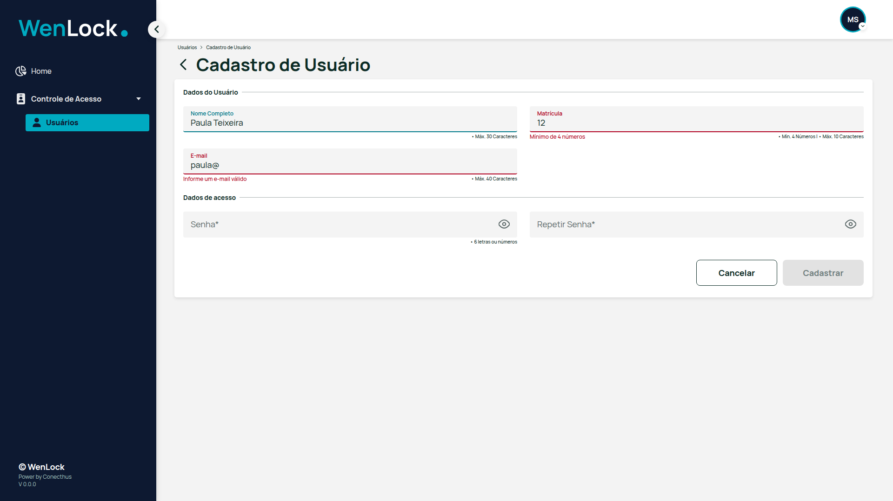
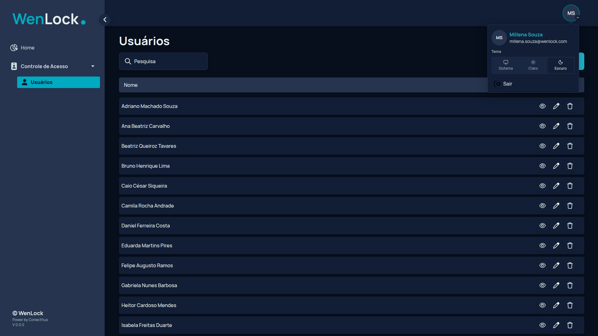
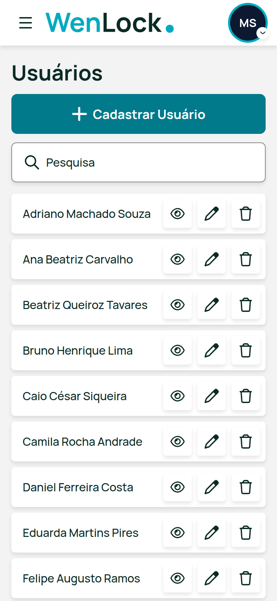
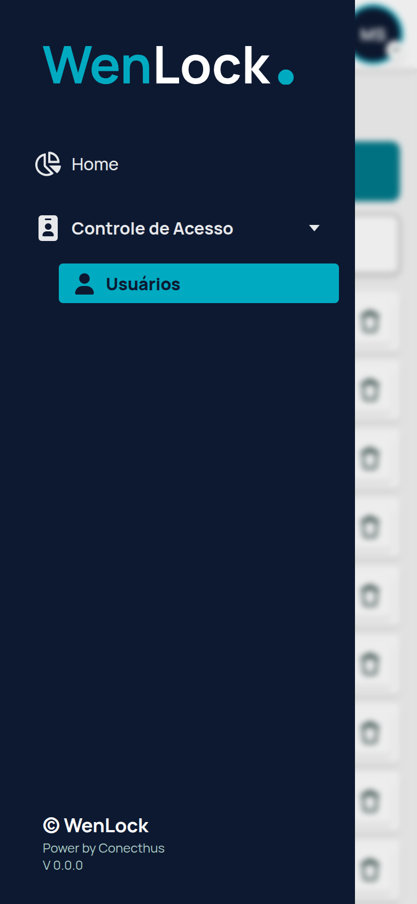
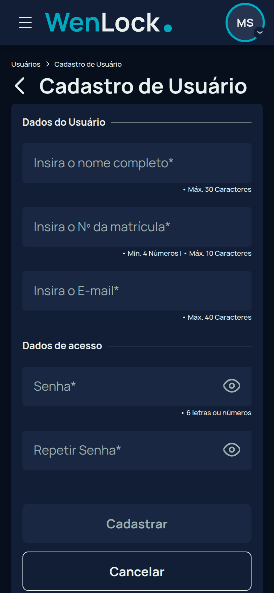

# WenLock · Frontend

Frontend do **WenLock**, sistema de controle de acesso com CRUD completo de usuários. É a solução da avaliação prática para Desenvolvedor Full Stack da Conecthus e segue o protótipo do Adobe XD tela a tela.

- **API:** [Conecthus-backend-av](https://github.com/Nobrinho/Conecthus-backend-av) (NestJS + PostgreSQL + Swagger)
- **Stack:** Next.js 16 (App Router) · React 19 · TypeScript · Tailwind CSS v4 · React Hook Form + Zod · Vitest · Playwright + axe

| Login                                                           | Usuários                                                       |
| --------------------------------------------------------------- | -------------------------------------------------------------- |
|                  |  |
| **Cadastro com validação**                                      | **Tema escuro**                                                |
|  |          |

<p align="center">
  
  
  
</p>

## Começando

Pré-requisitos: Node 22 e a API rodando (veja o README do backend; `docker compose up` sobe API, banco, seed e Mailpit).

```bash
cp .env.example .env.local   # API_URL=http://localhost:3000/api/v1
npm install
npm run dev                  # http://localhost:3001
```

Entre com a usuária do seed: **`millena.souza@wenlock.com`** (ou a matrícula **`100001`**) e a senha **`abc123`**.

Com Docker, depois de subir a API: `docker compose up --build`. O front sobe em http://localhost:3001 e encontra a API em `host.docker.internal:3000`.

## Requisitos da avaliação → onde estão

| Requisito (PDF / protótipo)                                                                                                                                          | Implementação                                                                                                                                           |
| -------------------------------------------------------------------------------------------------------------------------------------------------------------------- | ------------------------------------------------------------------------------------------------------------------------------------------------------- |
| Framework front-end (React)                                                                                                                                          | Next.js 16 + React 19                                                                                                                                   |
| Tela de apresentação (Home), pág. 11                                                                                                                                 | `src/app/(app)/page.tsx`                                                                                                                                |
| Lista de usuários, págs. 12/13: pesquisa por nome e paginação                                                                                                        | `users-page.tsx`, `users-search.tsx`, `components/ui/pagination.tsx`. "Itens por página": 10, 15, 50, 80 ou 100 (padrão 10, os mesmos que a API aceita) |
| Cadastro, pág. 14                                                                                                                                                    | `src/features/users/components/user-form.tsx` (`mode="create"`)                                                                                         |
| Nome só letras · E-mail válido · Matrícula só números · Senha 6 alfanuméricos                                                                                        | `src/features/users/rules.ts` e `types.ts` (as mesmas regras do backend). O nome também exige nome e sobrenome ("Nome Completo" no protótipo)           |
| Salvar habilitado só com todos os campos válidos                                                                                                                     | `UserForm`: `isValid` do React Hook Form em `mode: "onChange"`                                                                                          |
| Todos os campos obrigatórios                                                                                                                                         | Schemas Zod + asterisco nos labels                                                                                                                      |
| Edição, pág. 23                                                                                                                                                      | `UserForm` (`mode="edit"`): Salvar habilita só com alteração válida                                                                                     |
| Exclusão, pág. 13                                                                                                                                                    | `users-list.tsx`: modal "Deseja excluir?" + toast. O "Excluir" da própria linha fica desabilitado, e a Server Action e a API recusam a autoexclusão     |
| Além do PDF: splash, login, recuperação de senha, loading, visualizar, modais de cancelar, toasts, estados vazio e sem resultado, tema claro/escuro, menu recolhível | `src/features/auth`, `src/features/users/components`, `src/components/layout`                                                                           |

Todas as 26 telas do protótipo foram mapeadas; os prints acima foram tirados do app real rodando contra a API.

## Arquitetura

Organização **feature-based**: o `app/` só cuida de roteamento e composição, e a lógica de negócio fica em `features/`.

```
src/
├── app/
│   ├── (auth)/             # login, recuperar-senha, redefinir-senha (sem sessão)
│   ├── (app)/              # rotas logadas, dentro do AppShell
│   │   ├── page.tsx        # Home
│   │   └── usuarios/       # lista, cadastro, [id]/editar
│   ├── api/health/         # GET /api/health
│   ├── layout.tsx          # fonte, tema (cookie → data-theme), providers
│   └── globals.css         # ponte tokens → Tailwind, escala fluida
├── features/
│   ├── auth/               # actions (login/logout/recuperação), telas, getCurrentUser
│   └── users/              # api, actions, regras, schemas, componentes
│       ├── index.ts        # API pública (client-safe)
│       └── server.ts       # API pública só de servidor (leitura com sessão)
├── components/
│   ├── ui/                 # Button, TextField, Dialog, Drawer, Toast, Pagination...
│   ├── layout/             # AppShell, Sidebar, menu do usuário, ThemeSwitcher
│   ├── icons/              # ícones extraídos dos vetores do XD (currentColor)
│   └── brand/              # logo e ilustrações do XD em SVG (cores por token)
├── styles/
│   ├── tokens/primitives.css   # camada 1: paleta e escalas do XD
│   └── themes/default.css      # camada 2: contrato semântico (claro/escuro)
├── lib/
│   ├── api/                # http (zod + ApiError) e authHttp (Bearer do cookie)
│   ├── session/            # cookies httpOnly da sessão
│   └── action-result.ts    # { ok, data } | { ok: false, error, fieldErrors }
├── config/                 # env (zod), rotas, tema, site
└── proxy.ts                # proteção de rotas, refresh de sessão, headers
e2e/                        # Playwright + API fake que espelha o backend
```

### Regras de dependência

```
app  →  features  →  components / lib / hooks / config
```

- Uma feature **não importa outra**. O que é compartilhado vai para `components/`, `lib/` ou `hooks/`.
- Fora da feature, importe pelo barrel: `@/features/users` (client-safe) ou `@/features/users/server` (código que usa cookies e API).
- `components/` não conhece regra de negócio. O `AppShell` recebe a action de logout por prop em vez de importar a feature `auth`.

### Fluxo de dados (BFF)

O navegador **só conversa com o Next**:

- **Leitura:** Server Components chamam a API com `authHttp` (ex.: `app/(app)/usuarios/page.tsx`). Busca e página ficam na URL (`?search=&page=`), então a lista é compartilhável e funciona com voltar/avançar.
- **Escrita:** Server Actions validam com Zod, chamam a API, fazem `revalidatePath` e **retornam** `ActionResult`, sem lançar erro. O 409 da API vira erro no campo certo (`fieldErrors`).
- **Sessão:** os tokens JWT ficam em cookies `httpOnly`, `sameSite=lax`. A URL da API (`API_URL`) é variável só de servidor. O `proxy.ts` renova o access token vencido com o refresh token antes do render (Server Components não gravam cookies) e redireciona para `/login?next=...` quando não há sessão.

### Design system e temas

Os temas foram pensados para que **mudar cores, criar um modo escuro ou outro tema seja apenas adicionar tokens**:

1. **Primitivos** (`styles/tokens/primitives.css`): a paleta crua extraída do _Specs mode_ do XD (navy `#0D1931`, teal `#0290A4`/`#00AAC1`, texto `#0B2B25`, Manrope). Nenhum componente usa estes valores diretamente.
2. **Contrato semântico** (`styles/themes/default.css`): papéis como `--surface`, `--fg`, `--brand`, `--chrome`, `--danger`, definidos com `light-dark(claro, escuro)`. O mesmo contrato atende Claro, Escuro e **Sistema** (segue o sistema operacional sem JavaScript).
3. **Tailwind** (`app/globals.css`): `@theme inline` expõe só os tokens semânticos (`bg-surface`, `text-fg-muted`...). As cores padrão do Tailwind foram removidas, então `bg-red-500` nem existe.

A escolha do tema fica em cookie, e o layout raiz já renderiza `data-theme` no servidor, sem flash de tema errado. Para criar um tema novo, adicione `[data-theme="nome"] { --surface: ...; ... }` em `styles/themes/`, importe em `globals.css` e registre o nome em `config/theme.ts`.

O teste `src/styles/tokens.test.ts` impede cor crua em componentes e confere que todo token exposto ao Tailwind existe no tema.

### Responsividade (celular, 720p, 1080p e 4K)

- **Escala fluida:** tudo é medido em `rem`. Até 1920px a raiz tem 16px, que corresponde 1:1 ao XD (desenhado em 1920). Acima disso a raiz cresce com a largura (`100vw / 120`, até 32px), então em 4K o layout é o XD ampliado 2×, e não uma miniatura.
- **Celular:** a sidebar vira gaveta (hambúrguer), a tabela vira lista de cartões com alvos de toque de 44px, o formulário fica em 1 coluna, o painel "Visualizar" ocupa a tela toda e os toasts ficam em largura total.
- **720p:** a sidebar pode ser recolhida para o trilho "WL." só com ícones, como no XD (estado salvo em cookie).
- O E2E valida as 4 resoluções × 2 temas: sem rolagem horizontal e sem violações WCAG 2 AA no axe.

## Decisões e trade-offs

- **Interpretação das regras:** "Senha alfanumérica de 6 dígitos" foi lida como _exatamente_ 6 letras ou números. "Apenas letras" aceita acentos e espaços entre palavras. O XD diz "Mín. 4 Letras" na matrícula, mas o PDF diz "apenas números", e prevaleceu o PDF: de 4 a 10 dígitos.
- **Nome e matrícula filtram a digitação:** o que não for letra ou número é descartado na hora. Senha e e-mail mostram o erro em vez de alterar o que foi digitado.
- **Repetir senha:** o campo existe no protótipo. Ele é validado só no front e não vai para a API.
- **Edição e senha:** a API nunca devolve a senha, então não há como pré-preenchê-la. Em branco, a senha atual é mantida; preenchida, segue a regra do cadastro.
- **Login por e-mail ou matrícula:** o campo do protótipo se chama "Usuário". O backend decide pelo formato (só dígitos = matrícula).
- **Contraste:** onde a cor do XD não atingia WCAG AA, foi usado o tom vizinho da mesma paleta. O botão teal passou de `#0290A4` (3,8:1) para `#017A8B` (5:1), o texto do toast verde é escuro e o vermelho do toast é `#D93A39`. O logotipo mantém as cores originais, porque logos são isentos (WCAG 1.4.3).
- **Fidelidade ao XD:** medidas, ícones, logo e ilustrações vêm direto dos arquivos do protótipo (vetores e px do artboard de 1920 ÷ 16 = rem), assim como as cores de hover e os textos dos toasts. O único texto sem tela no XD é o toast "Edição cancelada". O seletor de tema e o botão de menu do celular não existem no protótipo e usam ícones do `lucide-react`.
- **Datas no fuso de quem vê:** a API responde em UTC e as datas são formatadas no fuso do navegador. A data da Home usa o padrão do Next para conteúdo dependente do cliente (script inline antes da pintura), sem erro de hidratação.
- **Ninguém exclui a própria conta:** na lista, o "Excluir" da linha do usuário logado fica desabilitado com a dica "Você não pode excluir seu próprio usuário". A Server Action recusa o pedido com o id da sessão e a API também (403), porque só a tela não basta.
- **Nome completo:** o campo exige ao menos nome e sobrenome, na tela e na API.
- **Itens por página:** o padrão é 10 para a lista caber na tela sem rolagem e a paginação ficar sempre visível; 15 (o valor do protótipo), 50, 80 e 100 continuam no seletor.
- **Menu do avatar:** abre ao passar o mouse, como no protótipo, e também por clique, toque e teclado.
- **Sem TanStack Query:** com leitura em Server Components e escrita em Server Actions, não sobrou estado de servidor no cliente. Remover a biblioteca deixou o bundle e o código menores.
- **`<dialog>` nativo** para modais, painel e menu mobile: foco preso, Esc, fundo inerte e retorno de foco sem biblioteca.

## Scripts

| Script                    | O que faz                                         |
| ------------------------- | ------------------------------------------------- |
| `npm run dev`             | Servidor de desenvolvimento em :3001              |
| `npm run build` / `start` | Build e servidor de produção (:3001)              |
| `npm run lint`            | ESLint (inclui as regras do React Compiler)       |
| `npm run format:check`    | Prettier                                          |
| `npm run typecheck`       | `next typegen` + `tsc`                            |
| `npm test`                | Vitest (unitários e componentes)                  |
| `npm run test:e2e`        | Playwright (fluxos + responsivo + acessibilidade) |

### Variáveis de ambiente

| Variável              | Onde                                      | Padrão                         |
| --------------------- | ----------------------------------------- | ------------------------------ |
| `API_URL`             | só servidor (`env.server.ts`, `proxy.ts`) | `http://localhost:3000/api/v1` |
| `NEXT_PUBLIC_APP_URL` | público (`env.ts`)                        | `http://localhost:3001`        |

## Testes

- **Unitários (Vitest, 61 testes):** regras e schemas de usuário, caso a caso (inclusive nome completo e itens por página); sanitização e formatação de datas no fuso de quem vê; tokens de sessão (`exp` e `sub` do JWT); `ApiError`; o `UserForm` (botão desabilitado → habilitado, nome completo, filtro de caracteres, 409 no campo, edição sem alteração, modal de cancelar); e o guarda-corpo dos tokens de tema.
- **E2E (Playwright, 38 testes):** sobem uma **API fake** (`e2e/mock-api/server.mjs`) que espelha os endpoints do NestJS e o app em **build de produção**.
  - `auth.spec.ts`: rota protegida, "Campo Obrigatório", credenciais inválidas (toast e campos em vermelho), menu do avatar no hover, login por e-mail e por matrícula, sair, persistência do tema, recuperação e redefinição de senha.
  - `users.spec.ts`: paginação de 10 e troca de "Itens por página", busca, sem resultado, visualizar no painel lateral, cadastrar com validação (inclusive nome completo), matrícula duplicada, cancelar, editar, excluir e o bloqueio de excluir o próprio usuário.
  - `responsive.spec.ts`: roda em 8 projetos (celular, 720p, 1080p e 4K × claro e escuro), checando rolagem horizontal e axe WCAG 2 AA.

Para usar um Chromium já instalado, defina `PLAYWRIGHT_CHROMIUM_EXECUTABLE_PATH`. O E2E sobrescreve a pasta `.next`, então rode `npm run build` de novo antes de um `npm start` normal.

## Qualidade automatizada

- **Pre-commit** (Husky + lint-staged): `eslint --fix` e `prettier --write` nos arquivos alterados.
- **CI** (`.github/workflows/ci.yml`): lint, formatação, typecheck, testes e build em todo PR, e os testes E2E em job próprio.
